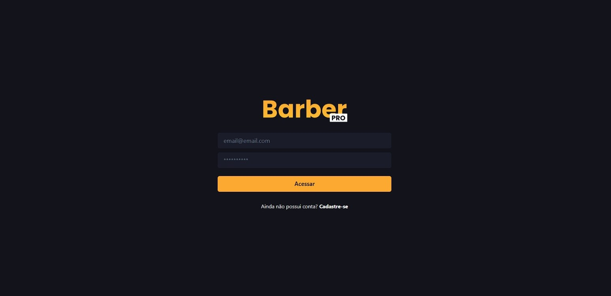

# BarberPRO Website

Este repositório contém o código-fonte para o site da barbearia **"BarberPRO"**.

## Descrição

O **BarberPRO System** é uma plataforma online projetada para barbearias realizarem o controle completo de suas operações. O sistema permite o cadastro de barbearias, gerenciamento de clientes, funcionários e agendamentos, além de funcionalidades exclusivas para edição e criação de modelos de cortes. 

---

## Funcionalidades Principais

- **Página Inicial:** 
  Uma introdução à barbearia e suas funcionalidades principais.
  
  

- **Cadastro de Barbearias:** 
  Permite que o proprietário registre sua barbearia, configurando o sistema para suas necessidades.

- **Cadastro de Funcionários:** 
  Ferramenta para gerenciar os profissionais da barbearia.
   
  

- **Gestão de Planos:** 
  - Acesso a diferentes planos para liberação de funcionalidades:
    - **Plano Básico:** Controle limitado de cortes e clientes.
    - **Plano Premium:** Cadastros ilimitados de cortes e clientes, criação e edição de modelos de cortes, atualizações exclusivas.
      
    

- **Agendamento de Clientes:** 
  - Cadastro de clientes com horários específicos para atendimentos.
  
  
  

- **Agenda Integrada:** 
  - Visualização e gerenciamento de horários agendados.
  
  

## Tecnologias Utilizadas

- **Node.js:** Ambiente de execução JavaScript.
- **Prisma:** ORM para o PostgreSQL.
- **TypeScript:** Superset de JavaScript que adiciona tipagem estática.
- **JSON:** Formato de dados utilizado para configurações.
- **Next.js:** Framework React para renderização do lado do servidor.
- **PostgreSQL:** Banco de dados relacional.
- **JWT:** Protocolo de autenticação JSON Web Token.

---

## Como Acessar o Projeto

Para ter acesso ao projeto completo, baixe-o através do link:  
[Download do Projeto](https://drive.google.com/file/d/1T3LWb0jVuHQR5I3WBymjAgsIjotz5JnX)
